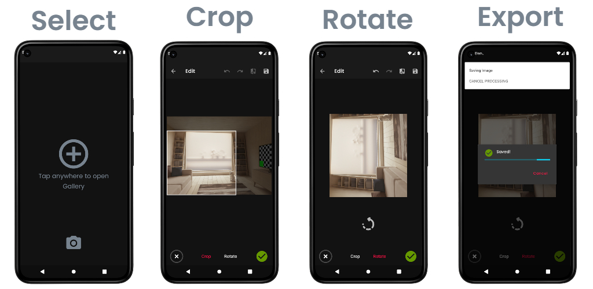

# Elementary Editor

Elementary Editor is a minimalistic image editor supporting Crop & Rotate functionality. The app was built by the 'Build Your Own' spirit to learn Android's Custom View, Touch & Gesture handling APIs. Inspired from the talk ['How to cook a well-done MVI for Android'](https://www.youtube.com/watch?v=Ls0uKLqNFz4) app uses its own-cooked MVI architecture backed by Kotlin Flows.

_Initial UI wireframe_: [link](https://excalidraw.com/#json=jNM9NsQo2wud7YGNL6raj,VDVGFVMjls5xgdRgW2V24A)

# Download

_Play Store link coming soon…_

## Supported Features
1. **Crop** - Freeform rectangular Cropping
1. **Rotate** - By 90-degree steps
1. **Peek First** - One tap Before/After comparison
1. **Export** - High-resolution images at the very end

## Libraries used
* [Navigation Component](https://developer.android.com/guide/navigation) - Managing navigation across fragments
* [Coroutines](https://kotlinlang.org/docs/coroutines-overview.html) - Asynchronous programming
* [Kotlin Flow](https://kotlinlang.org/docs/flow.html) - Reactive streams
* [WorkManager](https://developer.android.com/topic/libraries/architecture/workmanager) - Scheduling Background tasks
* [Timber](https://github.com/JakeWharton/timber) - Logging
* [Glide](https://github.com/bumptech/glide) -  Image Loading, Caching, Bitmap Pool
* [Moshi](https://github.com/square/moshi) - JSON Serialization

## Credits
* Many app icons alongside the launcher one are taken from https://www.svgrepo.com/
* UI/UX inspiration: [Snapseed Android App](https://play.google.com/store/apps/details?id=com.niksoftware.snapseed&hl=en_IN&gl=US)

License
-------

    Copyright 2021 Kshitij Patil

    Licensed under the Apache License, Version 2.0 (the "License");
    you may not use this file except in compliance with the License.
    You may obtain a copy of the License at

    http://www.apache.org/licenses/LICENSE-2.0

    Unless required by applicable law or agreed to in writing, software
    distributed under the License is distributed on an "AS IS" BASIS,
    WITHOUT WARRANTIES OR CONDITIONS OF ANY KIND, either express or implied.
    See the License for the specific language governing permissions and
    limitations under the License.
